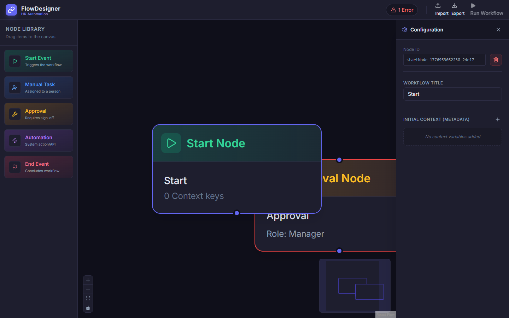

# HR Workflow Designer – Case Study

## 1. Overview
The HR Workflow Designer is a production-quality, browser-based visual tool engineered to allow human resources teams and administrators to map out, configure, and simulate complex employment lifecycles (like Employee Onboarding, Offboarding, and Hardware Requests) via an intuitive drag-and-drop interface. 

By taking an otherwise abstracted task (defining business logic) and moving it to a visual Directed Acyclic Graph (DAG), the application significantly lowers the technical barrier for HR staff to design systems while maintaining strict underlying logic that developers can parse and execute.

## 2. Tech Stack
- **Framework:** React 18, utilizing Vite for near-instant Hot Module Replacement (HMR) and an optimized production build pipeline.
- **Language:** TypeScript 5, ensuring robust type safety for all internal definitions (node schemas, API schemas, execution payload boundaries).
- **Core Library:** `@xyflow/react` (React Flow v12) for orchestrating the canvas math, edge routing, and node management.
- **State Management:** `Zustand`. Extremely lightweight, hook-based, immutable state transitions. Eliminates Context API re-render cascading.
- **Styling:** Tailwind CSS v3, utilizing bespoke CSS variables to allow seamless dark-mode integration.
- **Icons:** `lucide-react` for clean, tree-shakeable SVG icons.

## 3. Architecture
The application is composed of heavily decoupled components communicating through a centralized pipeline:
- **Canvas View:** The React Flow interactive ground. It is completely dumb and relies solely on the globally exposed Zustand hooks to fetch Nodes, Edges, and Handlers.
- **Node Component Layer:** Fully customized `NodeType` wrappers. Each node overrides standard bounds, integrating validation status alerts directly over the canvas.
- **Dynamic Config Engine:** The right-hand side panel parses the universally shared `selectedNodeId` state and dynamically mounts corresponding React form structures (`TaskNodeForm`, `ApprovalNodeForm`, etc.) feeding data mutations directly to the active node.
- **Data Extractor:** Dedicated utilities for sanitizing graph geometry into flat, execution-ready JSON architectures perfectly formatted for future backend ingestion.

## 4. Features
- **Visual Node Placement:** Drag-and-drop library (or click-to-add fallback mechanism for tight environments) implementing Start, Request, Approval, Automated Action, and End states.
- **Live Form Binding:** Interacting with a node summons a specialized side-panel form. Edits automatically sync to node properties and visuals.
- **Topological Simulation:** Generates synthetic backend latency via Kahn's Topological Sort algorithm to step through the flowchart and validate the execution path, displaying animated logs representing success/failure.
- **Real-Time Strict Graph Validation:** A BFS algorithm constantly combs the graph during any user mutation to check for disconnected components, illegal edges (e.g. End Node attempting to fire a task), or duplicated Start sequences.

## 5. API Design
To keep frontend cycles unblocked during integration, an asynchronous Mock API Layer intercepts execution attempts:
- **GET `/automations`**
Returns a dynamically generated schema dictating what automated services are available (e.g., Slack Webhooks, Mailgun, HRIS integration). Formally tells the frontend how to conditionally render parameters (Inputs vs Select Option Dropdowns).
- **POST `/simulate`**
Accepts a JSON-parsed graph (Nodes + Edges keys). Computes graph traversal order internally based on dependencies and sequentially mocks responses with latency (and a 5% mock failure rate) simulating realistic distributed environment hurdles. Outputs `SimulationLog[]` shapes.

## 6. Challenges
- **HTML5 Drag-and-Drop Limitations:** React Flow's coordinate transformation mechanics can clash with browser-specific HTML5 DataTransfer strictness payload shedding. 
*Solution:* Implemented robust `application/reactflow` alongside generic `text/plain` fallback payloads. Added an explicitly accessible `onClick` placement mode guaranteeing usability inside heavily restricted browsers or trackpad platforms.
- **State De-synchronization:** Editing nested configuration forms (which might deeply mutate arrays) risked detaching from the React Flow local state.
*Solution:* Bypassed React Flow's local state entirely by making Zustand the sole source of truth and feeding `<ReactFlow>` strictly bound `nodes/edges` properties attached directly to `updateNodeData`.

## 7. Improvements
- **Zoom-to-Fit Edge Calculations:** Enhancing edge collision rules using specialized pathfinding variables so connection lines do not obscure node labels.
- **Sub-Workflows:** Permitting automated nodes to open and visually expand into secondary, lower-level child graphs.
- **Backend Persistence Layer:** Upgrading the application from pure Next/React onto a persistence layer via PostgreSQL using Prisma, natively storing JSON geometries generated by the UI.

## 8. GitHub Link
[Your GitHub Repository Link Here]
